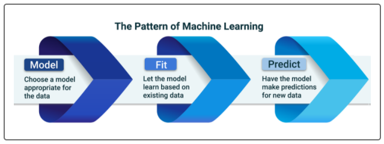
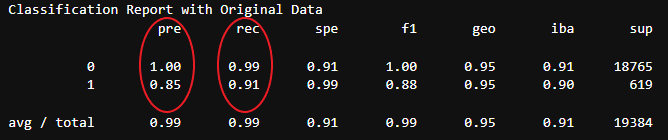
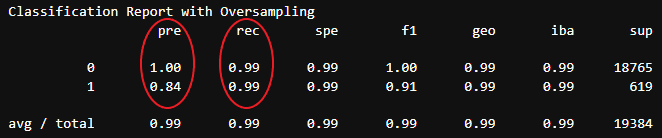

# Challenge 12: Supervised Machine Learning

UNCC Online FinTech Bootcamp Module 12 Challenge due by 11:59pm 2/27/2022

image from [courses.bootcampspot.com](https://courses.bootcampspot.com/courses/980/pages/12-dot-1-4-model-fit-predict?module_item_id=377651)

---

## Background

Credit risk poses a classification problem that’s inherently imbalanced. This is because healthy loans easily outnumber risky loans. In this Challenge, we’ll use various techniques to train and evaluate models with imbalanced classes. We’ll use a dataset of historical lending activity from a peer-to-peer lending services company to build a model that can identify the creditworthiness of borrowers.

---
## What's Being Created

Using our knowledge of the imbalanced-learn library, we’ll use a logistic regression model to compare two versions of the dataset. First, we’ll use the original dataset. Second, we’ll resample the data by using the RandomOverSampler module from the imbalanced-learn library.

For both cases, we’ll get the count of the target classes, train a logistic regression classifier, calculate the balanced accuracy score, generate a confusion matrix, and generate a classification report.

---

## Technologies

This application is written in Python 3.7 using JupyterLab version 3.0.14.

Python libraries used:

 - [NumPy](https://numpy.org/) - *a Python library that provides a multidimensional array object, various derived objects (such as masked arrays and matrices), and an assortment of routines for fast operations on arrays, including mathematical, logical, shape manipulation, sorting, selecting, I/O, discrete Fourier transforms, basic linear algebra, basic statistical operations, random simulation and much more.*
 - [Pandas](https://pandas.pydata.org/pandas-docs/stable/) - *an open source, BSD-licensed library providing high-performance, easy-to-use data structures and data analysis tools for the Python programming language.*
 - [Pathlib](https://docs.python.org/3.7/library/pathlib.html) - *a library that enables consistent input and output of files from the main app.*
 - [hvPlot](https://hvplot.holoviz.org/user_guide/Introduction.html) - *a high-level plotting API for the PyData ecosystem built on HoloViews.*
 - [scikit-learn](https://scikit-learn.org/stable/user_guide.html) - *an open source machine learning library that supports supervised and unsupervised learning.*
 - [imbalanced-learn](https://imbalanced-learn.org/stable/) - *imbalanced-learn is a python package offering a number of re-sampling techniques commonly used in datasets showing strong between-class imbalance.*

### Installation Guide

prior to running these libraries, install them from the command line:
  - NumPy: `conda install numpy` or `pip install numpy`
  - pandas: `conda install pandas` or `pip install pandas`  
  - pathlib: `pip install pathlib`
  - hvPlot: `conda install -c pyviz hvplot` or `pip install hvplot`
  - scikit-learn: `pip install-U scikit-learn` - included in conda
  - imbalanced-learn: `conda install -c conda-forge imbalanced-learn` or `pip install -U imbalanced-learn`

---

## Usage

### Overview of the Analysis

* The purpose of this analysis is to see whether or not we get better predictive power by oversampling the imbalanced dataset, for the ultimate purpose of predicting whether a loan will be profitable (i.e. 'healthy'), or could cause a loss (i.e. 'high-risk').
* The dataset contains 7 features and one target related to classifying loans as 'healthy' or 'high-risk'.
* The dataset contains 75,036 healthy loans, and 2,500 high-risk loans.
* The stages of the machine learning process included: 
    - Splitting the data into training and testing datasets by using `train_test_split`;
    - Fitting a logistic regression model by using the training data (`X_train` and `y_train`); and
    - Testing the predictive power of the model using the `X_test` data.
* For this analysis, we will use `LogisticRegression`, with and without oversampling. The purpose of oversampling is to give the minority class (i.e. 'high-risk' loans) greater visibility during the fitting of the model.

### Results

Below is a description of the balanced accuracy scores and the precision and recall scores of the machine learning models.

* Logistic Regression, using original data (i.e. No resampling):
  * Accuracy (`balanced_accuracy_score`): 95.2%;
  * Precision, and Recall scores: 100%/85%; 99%/91%, respectively (healthy vs high-risk)
  

* Logistic Regression, using **resampled data** (`RandomOverSampler`):
  * Accuracy (`balanced_accuracy_score`): 99.4%;
  * Precision, and Recall scores: 100%/84%; 99%/99%, respectively (healthy vs high-risk)
  
  
### Summary

Overall, our predictive power increased by using the Random Oversampling method. We see that our accuracy improved from 95% to 99% (`balanced_accuracy_score`). Even though the precision for the high-risk loans was  slightly lower at 84% (down from 85%), great improvement was seen in the recall rate for high-risk loans, to 99% (up from 91% in the original imbalanced dataset); and so f1 score also improved in the high-risk loans from 88% to 91%. I'd say the logistic regression model worked well in this case using oversampled data, to give the minority class more visibility during the training phase. In this case, it was important to be able to predict the high-risk loans (target=1) since it only takes a few bad loans to wipe out the profits generated from many good loans.

---

## Contributors

Geoff Tarleton - jobeycat@protonmail.com

adapted from Starter Code supplied by UNCC FinTech Online Bootcamp by Trilogy Educational Services, a 2U, Inc. brand.

---

## License

[MIT](LICENSE)